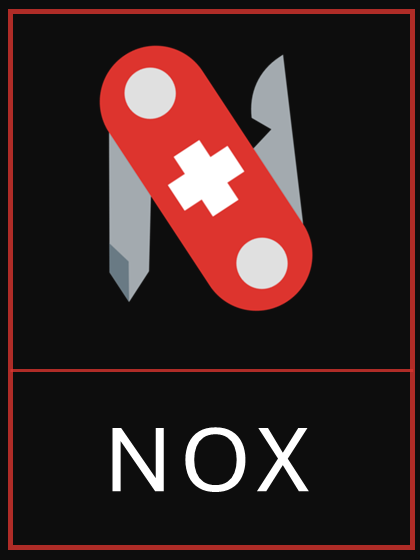
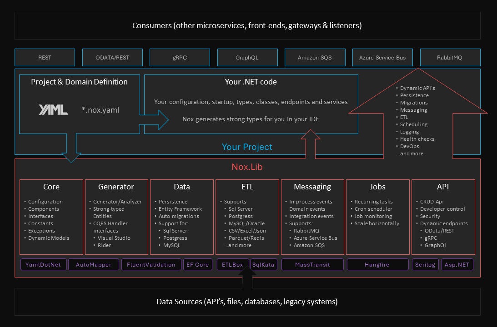

<!-- Improved compatibility of back to top link: See: https://github.com/othneildrew/Best-README-Template/pull/73 -->
<a name="readme-top"></a>
<!--
*** Thanks for checking out the Best-README-Template. If you have a suggestion
*** that would make this better, please fork the repo and create a pull request
*** or simply open an issue with the tag "enhancement".
*** Don't forget to give the project a star!
*** Thanks again! Now go create something AMAZING! :D
-->

<!-- PROJECT SHIELDS -->
<!--
*** I'm using markdown "reference style" links for readability.
*** Reference links are enclosed in brackets [ ] instead of parentheses ( ).
*** See the bottom of this document for the declaration of the reference variables
*** for contributors-url, forks-url, etc. This is an optional, concise syntax you may use.
*** https://www.markdownguide.org/basic-syntax/#reference-style-links
-->
[![Contributors][contributors-shield]][contributors-url]
[![Forks][forks-shield]][forks-url]
[![Stargazers][stars-shield]][stars-url]
[![Issues][issues-shield]][issues-url]
[![MIT License][license-shield]][license-url]
[![LinkedIn][linkedin-shield]][linkedin-url]

<!-- PROJECT LOGO -->
<br />
<div align="center">
  <a href="https://github.com/noxorg/nox">
    
  </a>
<!--
<h3 align="center">Nox</h3>
-->
  <p align="center">
    Build and deploy enterprise-grade microservices in under an hour
    <br />
    <br />
    <a href="https://github.com/noxorg/nox"><strong>View the documentation »</strong></a>
    <br />
    <br />
    <a href="https://github.com/noxorg/Nox">View Demo</a>
    ·
    <a href="https://github.com/noxorg/Nox/issues">Report Bug</a>
    ·
    <a href="https://github.com/noxorg/Nox/issues">Request Feature</a>
  </p>
</div>
    <br />


<!-- TABLE OF CONTENTS -->
<details>
  <summary>Table of Contents</summary>
  <ol>
    <li>
      <a href="#about-the-project">About The Project</a>
      <ul>
        <li><a href="#built-with">Built With</a></li>
      </ul>
    </li>
    <li>
      <a href="#getting-started">Getting Started</a>
      <ul>
        <li><a href="#prerequisites">Prerequisites</a></li>
        <li><a href="#installation">Installation</a></li>
      </ul>
    </li>
    <li><a href="#usage">Usage</a></li>
    <li><a href="#roadmap">Roadmap</a></li>
    <li><a href="#contributing">Contributing</a></li>
    <li><a href="#license">License</a></li>
    <li><a href="#contact">Contact</a></li>
    <li><a href="#acknowledgments">Acknowledgments</a></li>
  </ol>
  
</details>
<br />

<!-- ABOUT THE PROJECT -->
## About The Project

Nox is a .NET microservice framework that allows developers to develop enterprise-grade, production-ready microservices in under an hour. 

It removes all the ceremony, repition and technical details associated with building and maintaining applications without constraining developer creativity or control in any way.

<div align="center">
    
</div>
<br />

## Main Features

Nox lets you focus on your business problem and domain, and provides you with the following auto-magic features:-

- Declaration of your core application and domain (models, data, entities, attributes and bounded contexts) in a declaritive and easily maintainable way (YAML, using YamlDotNet)
- Automatic (and selective) Create, Read, Update and Delete (CRUD) API for entities and/or aggregate roots (supports REST with OData, with GraphQL and gRPC in the making)
- The choice of persisting your data in any database with current support for Sql Server, Postgress or MySql (using Entity Framework)
- Automated Database Migrations (coming soon)
- Validation of entities and attributes (using FluentValidation)
- Logging, Observability and Monitoring (using SeriLog)
- Events and Messaging (In process/Mediator, Azure Servicebus, Amazon SQS, RabbitMQ) using MassTransit
- Extract-transform and load definitions from any database, file or API with bulk load and merge support
- A task scheduler for running recurring tasks at periodic intervals (using Hangfire)
- Automated DevOps including testing and deployment

<p align="right">(<a href="#readme-top">back to top</a>)</p>

### Built With

[![.NET][.NET]][.NET-url]
[![ETLBox][ETLBox]][ETLBox-url]
[![AutoMapper][AutoMapper]][AutoMapper-url]
[![Hangfire][Hangfire.io]][Hangfire-url]
[![MassTransit][MassTransit]][MassTransit-url]
[![YamlDotNet][YamlDotNet]][YamlDotNet-url]
[![FluentValidation][FluentValidation]][FluentValidation-url]

<p align="right">(<a href="#readme-top">back to top</a>)</p>

<!-- GETTING STARTED -->
## Getting Started

Create a standard .NET 6.0 web api project at the command line.
```powershell
cd repos

dotnet new webapi -o MyCurrencyApi

cd MyCurrencyApi

dotnet add package Nox.Lib
```
At this point you can do a normal `dotnet run` which will present you with the standard Microsoft WeatherController.

Next, create a new file to define your service called `currency.service.nox.yaml`:
```yaml
#
# myapi.service.nox.yaml
#

Name: MyCurrencyApi

Description: My Currency Microservice

Database:
  Name: MyCurrencyApiDb
  Provider: SqlServer
  Options: Trusted_Connection=no;connection timeout=120;
  Server: localhost
  User: sa
  Password: Developer*123
     
```


```powershell
dotnet run
```
### Prerequisites

This is an example of how to list things you need to use the software and how to install them.
* npm
  ```sh
  npm install npm@latest -g
  ```

### Installation

1. Get a free API Key at [https://example.com](https://example.com)
2. Clone the repo
   ```sh
   git clone https://github.com/noxorg/Nox.git
   ```
3. Install NPM packages
   ```sh
   npm install
   ```
4. Enter your API in `config.js`
   ```js
   const API_KEY = 'ENTER YOUR API';
   ```

<p align="right">(<a href="#readme-top">back to top</a>)</p>


<!-- USAGE EXAMPLES -->
## Usage

Use this space to show useful examples of how a project can be used. Additional screenshots, code examples and demos work well in this space. You may also link to more resources.

_For more examples, please refer to the [Documentation](https://example.com)_

<p align="right">(<a href="#readme-top">back to top</a>)</p>


<!-- ROADMAP -->
## Roadmap

- [ ] Feature 1
- [ ] Feature 2
- [ ] Feature 3
    - [ ] Nested Feature

See the [open issues](https://github.com/github_username/repo_name/issues) for a full list of proposed features (and known issues).

<p align="right">(<a href="#readme-top">back to top</a>)</p>


<!-- CONTRIBUTING -->
## Contributing

Contributions are what make the open source community such an amazing place to learn, inspire, and create. Any contributions you make are **greatly appreciated**.

If you have a suggestion that would make this better, please fork the repo and create a pull request. You can also simply open an issue with the tag "enhancement".
Don't forget to give the project a star! Thanks again!

1. Fork the Project
2. Create your Feature Branch (`git checkout -b feature/AmazingFeature`)
3. Commit your Changes (`git commit -m 'Add some AmazingFeature'`)
4. Push to the Branch (`git push origin feature/AmazingFeature`)
5. Open a Pull Request

<p align="right">(<a href="#readme-top">back to top</a>)</p>


<!-- LICENSE -->
## License

Distributed under the MIT License. See `LICENSE.txt` for more information.

<p align="right">(<a href="#readme-top">back to top</a>)</p>


<!-- CONTACT -->
## Contact

Andre Sharpe - [@twitter_handle](https://twitter.com/AndreSharpe72) 

Project Link: [https://github.com/noxorg/nox](https://github.com/github_username/repo_name)

<p align="right">(<a href="#readme-top">back to top</a>)</p>


<!-- ACKNOWLEDGMENTS -->
## Acknowledgments

* []()
* []()
* []()

<p align="right">(<a href="#readme-top">back to top</a>)</p>


<!-- MARKDOWN LINKS & IMAGES -->
<!-- https://www.markdownguide.org/basic-syntax/#reference-style-links -->
[contributors-shield]: https://img.shields.io/github/contributors/noxorg/Nox.svg?style=for-the-badge
[contributors-url]: https://github.com/noxorg/Nox/graphs/contributors
[forks-shield]: https://img.shields.io/github/forks/noxorg/Nox.svg?style=for-the-badge
[forks-url]: https://github.com/noxorg/Nox/network/members
[stars-shield]: https://img.shields.io/github/stars/noxorg/Nox.svg?style=for-the-badge
[stars-url]: https://github.com/noxorg/Nox/stargazers
[issues-shield]: https://img.shields.io/github/issues/noxorg/Nox.svg?style=for-the-badge
[issues-url]: https://github.com/noxorg/Nox/issues
[license-shield]: https://img.shields.io/github/license/noxorg/Nox.svg?style=for-the-badge
[license-url]: https://github.com/noxorg/Nox/blob/master/LICENSE.txt
[linkedin-shield]: https://img.shields.io/badge/-LinkedIn-black.svg?style=for-the-badge&logo=linkedin&colorB=555
[linkedin-url]: https://ch.linkedin.com/in/sharpeandre
[product-screenshot]: images/goo-goo.gif
[ETLBox]: https://img.shields.io/badge/ETLBox-000000?style=for-the-badge
[ETLBox-url]: https://www.etlbox.net/
[React.js]: https://img.shields.io/badge/React-20232A?style=for-the-badge&logo=react&logoColor=61DAFB
[React-url]: https://reactjs.org/
[Bootstrap.com]: https://img.shields.io/badge/Bootstrap-563D7C?style=for-the-badge&logo=bootstrap&logoColor=white
[Bootstrap-url]: https://getbootstrap.com
[Hangfire.io]: https://img.shields.io/badge/Hangfire-0769AD?style=for-the-badge
[Hangfire-url]: https://www.hangfire.io/ 
[.NET]: https://img.shields.io/badge/.NET-512BD4?style=for-the-badge&logo=dotnet&logoColor=white
[.NET-url]: https://dotnet.microsoft.com/
[MassTransit]: https://img.shields.io/badge/MassTransit-0EA5E9?style=for-the-badge
[MassTransit-url]: https://masstransit-project.com/
[YamlDotNet]: https://img.shields.io/badge/YamlDotNet-8B0000?style=for-the-badge
[YamlDotNet-url]: https://github.com/aaubry/YamlDotNet
[AutoMapper]: https://img.shields.io/badge/AutoMapper-BE161D?style=for-the-badge
[AutoMapper-url]: https://automapper.org/
[FluentValidation]: https://img.shields.io/badge/FluentValidation-2980B9?style=for-the-badge
[FluentValidation-url]: https://docs.fluentvalidation.net/
