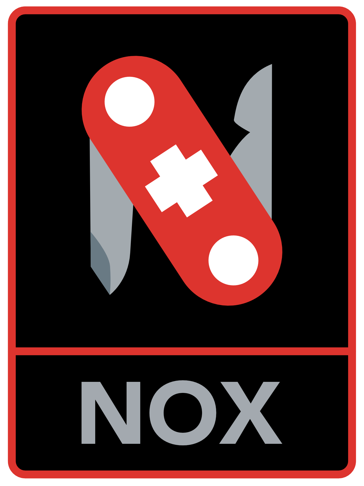

<!-- Improved compatibility of back to top link: See: https://github.com/othneildrew/Best-README-Template/pull/73 -->
<a name="readme-top"></a>
<!--
*** Thanks for checking out the Best-README-Template. If you have a suggestion
*** that would make this better, please fork the repo and create a pull request
*** or simply open an issue with the tag "enhancement".
*** Don't forget to give the project a star!
*** Thanks again! Now go create something AMAZING! :D
-->

<!-- PROJECT SHIELDS -->
<!--
*** I'm using markdown "reference style" links for readability.
*** Reference links are enclosed in brackets [ ] instead of parentheses ( ).
*** See the bottom of this document for the declaration of the reference variables
*** for contributors-url, forks-url, etc. This is an optional, concise syntax you may use.
*** https://www.markdownguide.org/basic-syntax/#reference-style-links
-->
[![Build][build-shield]][build-url]
[![Contributors][contributors-shield]][contributors-url]
[![Forks][forks-shield]][forks-url]
[![Stargazers][stars-shield]][stars-url]
[![Security][security-shield]][security-url]

<!-- PROJECT LOGO -->
<br />
<div align="center">
  <a href="https://github.com/noxorg/nox">
    
  </a>
<!--
<h3 align="center">Nox</h3>
-->
  <p align="center">
    <br />
    Build and deploy enterprise-grade business solutions in under an hour
    <br />
    <br />
    <a href="https://noxorg.dev"><strong>View the documentation »</strong></a>
    <br />
    <br />
    <a href="https://github.com/noxorg/nox">View Demo</a>
    ·
    <a href="https://github.com/noxorg/nox/issues">Report Bug</a>
    ·
    <a href="https://github.com/noxorg/nox/issues">Request Feature</a>
  </p>
</div>
    <br />


<!-- TABLE OF CONTENTS -->
<details>
  <summary>Table of Contents</summary>
  <ol>
    <li>
      <a href="#about-the-project">About The Project</a>
      <ul>
        <li><a href="#main-features">Main Features</a></li>
        <li><a href="#built-with">Built With</a></li>
      </ul>
    </li>
    <li>
      <a href="#getting-started">Getting Started</a>
      <ul>
        <li><a href="#prerequisites">Prerequisites</a></li>
        <li><a href="#creating-a-project">Creating a Project</a></li>
        <li><a href="#adding-nox">Adding Nox</a></li>
        <li><a href="#define-your-service-and-entities">Define Your Service and Entities</a></li>
        <li><a href="#setup-sqlServer-with-docker">Setup SqlServer with Docker</a></li>
        <li><a href="#start-your-service">Start Your Service</a></li>
        <li><a href="#exploring-your-new-aPI">Exploring Your New API</a></li>
        <li><a href="#swagger-docs">Swagger Docs</a></li>
        <li><a href="#add-a-currency">Add a Currency</a></li>
        <li><a href="#display-curriencies">Display Currencie</a></li>
        <li><a href="#filtering-and-pagination">Filtering and Pagination</a></li>
        <li><a href="#next-steps">Next Steps</a></li>
      </ul>
    </li>
    <li><a href="#roadmap">Roadmap</a></li>
    <li><a href="#contributing">Contributing</a></li>
    <li><a href="#license">License</a></li>
    <li><a href="#contact">Contact</a></li>
    <li><a href="#acknowledgments">Acknowledgments</a></li>
  </ol>
  
</details>
<br />

<!-- ABOUT THE PROJECT -->
## About The Project
***
Nox is a .NET framework that allows developers to rapidly build, maintain and deploy enterprise-grade, production-ready business solutions. 

It removes all the ceremony, repetition and technical details associated with building and maintaining applications without constraining developer creativity or control in any way.

<div align="center">
    
</div>
<br />

### Main Features
---
Nox lets you focus on your business problem and domain, and provides you with the following auto-magic features:

- Declaration of your core application and domain (models, data, entities, attributes and bounded contexts) in a declaritive and easily maintainable way (YAML, using YamlDotNet)
- Automatic (and selective) Create, Read, Update and Delete (CRUD) API for entities and/or aggregate roots (supports REST with OData, with GraphQL and gRPC in the making)
- The choice of persisting your data in any database with current support for Sql Server, PostgreSQL or MySql (using Entity Framework)
- Automated Database Migrations (coming soon)
- Validation of entities and attributes (using FluentValidation)
- Logging, Observability and Monitoring (using SeriLog)
- Events and Messaging (In process/Mediator, Azure Servicebus, Amazon SQS, RabbitMQ) using MassTransit
- Extract, transform and load (ETL) definitions from any database, file or API with bulk-load and merge support
- A task scheduler for running recurring tasks at periodic intervals (using Hangfire)
- Automated DevOps including testing and deployment

<p align="right">(<a href="#readme-top">back to top</a>)</p>

### Built With
---
[![.NET][.NET]][.NET-url]
[![ETLBox][ETLBox]][ETLBox-url]
[![AutoMapper][AutoMapper]][AutoMapper-url]
[![Hangfire][Hangfire.io]][Hangfire-url]
[![MassTransit][MassTransit]][MassTransit-url]
[![YamlDotNet][YamlDotNet]][YamlDotNet-url]
[![FluentValidation][FluentValidation]][FluentValidation-url]

<p align="right">(<a href="#readme-top">back to top</a>)</p>

<!-- GETTING STARTED -->
## Getting Started
***
### Prerequisites
---

Make sure you have .NET 6 and Docker installed on your PC.
```powershell
dotnet --version

docker-compose --version
```
### Creating a Project
---
Create a .NET 6.0 web api project at the command line in your repositories using the `dotnet` command-line tool.
```powershell
dotnet new webapi -o SampleCurrencyService

cd SampleCurrencyService
```
At this point you can do a normal `dotnet run` which will present you with the standard Microsoft demo WeatherForecast.

### Adding Nox
---
Add the Nox.Lib nuget package to your project.
```powershell
dotnet add package Nox.Lib
```
Edit your Program.cs file and add/modify the following 👇 code sections:
```csharp
// (1) 👇 Add the following use library statement
using Nox;

var builder = WebApplication.CreateBuilder(args);

// Add services to the container.

builder.Services.AddControllers();
// Learn more about configuring Swagger/OpenAPI at https://aka.ms/aspnetcore/swashbuckle
builder.Services.AddEndpointsApiExplorer();

// (2) 👇 The Nox library has Swagger built-in. Comment the line below out.
//builder.Services.AddSwaggerGen();

// (3) 👇 Add Nox to the service collection
builder.Services.AddNox();

var app = builder.Build();

// (4) 👇 Add Nox to the application middleware
app.UseNox();

// Configure the HTTP request pipeline.
if (app.Environment.IsDevelopment())
{
    app.UseSwagger();
    app.UseSwaggerUI();
}

app.UseHttpsRedirection();

app.UseAuthorization();

app.MapControllers();

app.Run();
```
### Define your Solution and Entities
---
Create a new file to define your solution called `SampleCurrency.service.nox.yaml`
```yaml
#
# SampleCurrency.service.nox.yaml
#
# yaml-language-server: $schema=https://noxorg.dev/schemas/NoxConfiguration.json
#

name: SampleCurrencyService

description: Sample Currency Microservice

autoMigrations: true

database:
  name: SampleCurrencyDb
  provider: sqlServer
  options: Trusted_Connection=no;connection timeout=120;TrustServerCertificate=True
  server: localhost
  user: sa  
  password: Developer*123

messagingProviders:
  - name: InProcess
    provider: mediator
```
Create an entity definition in `Currency.entity.nox.yaml`

```yaml
#
# Currency.entity.nox.yaml
#

name: Currency
description: Currency definition and related data

attributes:

  - name: Id
    description: The currency's unique identifier 
    isPrimaryKey: true
    type: int

  - name: Name
    description: The currency's name 
    isRequired: true
    type: string
    maxWidth: 128

  - name: ISO_Alpha3
    description: The currency's official ISO 4217 alpha-3 code
    isRequired: true
    isUnicode: false
    type: char
    minWidth: 3
    maxWidth: 3

  - name: Symbol
    description: The currency's well known symbol
    type: string
    maxWidth: 5
```
### Setup SqlServer with Docker
---
Create a `docker-compose.yaml` for running a Sql Server conatainer
```YAML
version: '3.7'

services:
  sqlserver:
    container_name: sqlserver_container
    image: "mcr.microsoft.com/azure-sql-edge:latest"
    user: root
    ports:
      - "1433:1433"
    environment:
      SA_PASSWORD: "Developer*123"
      ACCEPT_EULA: "Y"
      MSSQL_PID: "Developer"
    volumes:
      - ./.docker-data/sqlserver:/var/opt/mssql/data
```
Then start your database with:
```bash
docker-compose up -d
```
### Start Your Service
---
Finally, start your API with:
```powershell
dotnet run
```
The application will start up, Nox will dynamically process the YAML files. Take note of the port that `dotnet new webapi` assigned to your project.


In this case the `http` port is `5237` and we will use it below (use your port number wherever you see `5237` instead).

Alternatively, you can change the port your service uses by editing the `applicationUrl` in the `profiles` section in `.\Properties\launcgSettings.json` as follows.

```json
  "profiles": {
    "SampleCurrencyService": {
      "commandName": "Project",
      "dotnetRunMessages": true,
      "launchBrowser": true,
      "launchUrl": "swagger",
      "applicationUrl": "https://localhost:7237;http://localhost:5237",
      "environmentVariables": {
        "ASPNETCORE_ENVIRONMENT": "Development"
      }
    },
```
You will then be able to follow the exploration section of these docs using the same port.

### Exploring Your New API
---
Startup [Postman](https://www.postman.com/) or your browser and navigate to `http://localhost:5237/WeatherForecast` to see that the Microsoft standard weather forecast API works.


### Swagger Docs
---
To view the dynamic endpoints that Nox added to your project, browse to `http://localhost:5237/swagger`


### Add a Currency
---
In Postman, setup a `POST` request to `http://localhost:5237/api/Currencies`, and on the `Body` tab, set the `content-type` to `raw` and `JSON` and the body content to:

```json
{
    "Id": 8383,
    "Name": "Bitcoin",
    "Symbol": "₿",
    "ISO_Alpha3": "XBT"
}
```
When you click on the `Send` button, you should get a `201` (Created) response.


You can create an entry for US Dollars by replacing the body with:

```json
{
    "Id": 840,
    "Name": "US Dollar",
    "Symbol": "$",
    "ISO_Alpha3": "USD"
}
```


### Display Currencies
---

To display the currencies you've just added send a `GET` request to `http://localhost:5237/api/Currencies`


### Filtering and Pagination
---

You can try the following url's with `GET` to further explore the API.

```
http://localhost:5237/odata/Currencies(840)
http://localhost:5237/odata/Currencies(840)/Name
http://localhost:5237/odata/Currencies?$select=Id,Name
http://localhost:5237/odata/Currencies?$select=Id,Name&$orderby=Name
http://localhost:5237/odata/Currencies?$filter=Name eq 'US Dollar'
http://localhost:5237/odata/Currencies?$filter=Name ne 'US Dollar'
```

You can read up more about the many features of OData at [www.odata.org/](https://www.odata.org/)

### Next Steps
---

This quick-start is really just the tip of the Nox iceberg. To develop serious microservices for business requires quite a bit more than a quick API.

More documentation will be added shortly to help illustrate the broader feature-set of Nox-enabled applications.

<!-- ROADMAP -->
## Roadmap
***
- [ ] Model-driven gRPC API's automatically for high-performance inter-service communication
- [ ] GraphQL API automatically from YAML definitions
- [ ] Health monitoring and observability as a first class features
- [ ] ETL from files, API's and other database types
- [ ] Production caching usin ElasticSearch
- [ ] Full DevOps automation for creating, deploying and apgrading applications
- [ ] Multi-environment support (dev/test/uat/prod/...)
- [ ] Proper versioning of application changes accross deployments
- [ ] DotNet command line tooling for Nox to interactively create YAML files, Helm charts and other required DevOps artifacts
- [ ] E-Mail and other notification mechanisms for applications
- [ ] Automated Backend-for-Frontend (BFF) creation
- [ ] A universal Blazor-based UX that is dynamic rendered from the YAML definition
- [ ] Better Swagger and user project documentation generation
- [ ] A universal admin console to combine the various underlying library frontends (eg Hangfire) 


See the [open issues](https://github.com/noxorg/nox/issues) for a full list of proposed features (and known issues).

<p align="right">(<a href="#readme-top">back to top</a>)</p>


<!-- CONTRIBUTING -->
## Contributing
***
Contributions are what make the open source community such an amazing place to learn, inspire, and create. Any contributions you make are **greatly appreciated**.

If you have a suggestion that would make this better, please fork the repo and create a pull request. You can also simply open an issue with the tag "enhancement".
Don't forget to give the project a star! Thanks again!

1. Fork the Project
2. Create your Feature Branch (`git checkout -b feature/AmazingFeature`)
3. Commit your Changes (`git commit -m 'Add some AmazingFeature'`)
4. Push to the Branch (`git push origin feature/AmazingFeature`)
5. Open a Pull Request

### Hassle-free Development
---

The Nox project uses the [goo](https://goo.dev/) cross-platform development to make building and testing code hassle free.

```powershell
git clone https://github.com/noxorg/nox.git

cd Nox

.\.goo.ps1 init
```
This should guide you through the pre-requisites needed to productively build and change Nox.

To view the project workflows, type:
```
.\.goo.ps1
```
and it'll display something like:


<p align="right">(<a href="#readme-top">back to top</a>)</p>
You should then be able to simply type `goo` anywhere in your project folder structure to return you to the project root and display these options.


<!-- LICENSE -->
## License

Distributed under the MIT License. See `LICENSE.txt` for more information.

<p align="right">(<a href="#readme-top">back to top</a>)</p>


<!-- CONTACT -->
## Contact

Twitter: [@AndreSharpe72](https://twitter.com/AndreSharpe72) 

Project Link: [https://github.com/noxorg/nox](https://github.com/noxorg/nox)

<p align="right">(<a href="#readme-top">back to top</a>)</p>


<!-- ACKNOWLEDGMENTS -->
## Acknowledgments

* Nox was inspired and draws heavily from [Paul DeVito](https://github.com/pdevito3)'s very impressive [Wrapt](https://wrapt.dev/) project. Nox is essentially (a less feature-rich) Wrapt without the code generation and aims to keep developer code 100% separate from the framework, and imposes no constraints on application architecture.
* Nox would not have been possible without the many open-source projects that it draws from. The goal is to build on top of an already rich ecosystem of great libraries and tools like Microsoft's .NetCore, YamlDotNet, NewtonSoft.Json, Hangfire, Serilog, SqlKata, ETLBox, Entity Framework, MassTransit and others.

<p align="right">(<a href="#readme-top">back to top</a>)</p>


<!-- MARKDOWN LINKS & IMAGES -->
<!-- https://www.markdownguide.org/basic-syntax/#reference-style-links -->
[build-shield]: https://img.shields.io/github/actions/workflow/status/noxorg/nox/nox_ci.yaml?branch=main&event=push&label=Build&style=for-the-badge
[build-url]: https://github.com/NoxOrg/Nox/actions/workflows/nox_ci.yaml?query=branch%3Amain
[contributors-shield]: https://img.shields.io/github/contributors/noxorg/Nox.svg?style=for-the-badge
[contributors-url]: https://github.com/noxorg/Nox/graphs/contributors
[forks-shield]: https://img.shields.io/github/forks/noxorg/Nox.svg?style=for-the-badge
[forks-url]: https://github.com/noxorg/Nox/network/members
[stars-shield]: https://img.shields.io/github/stars/noxorg/Nox.svg?style=for-the-badge
[stars-url]: https://github.com/noxorg/Nox/stargazers
[issues-shield]: https://img.shields.io/github/issues/noxorg/Nox.svg?style=for-the-badge
[issues-url]: https://github.com/noxorg/Nox/issues
[license-shield]: https://img.shields.io/github/license/noxorg/Nox.svg?style=for-the-badge
[license-url]: https://github.com/noxorg/Nox/blob/master/LICENSE.txt
[linkedin-shield]: https://img.shields.io/badge/-LinkedIn-black.svg?style=for-the-badge&logo=linkedin&colorB=555
[linkedin-url]: https://ch.linkedin.com/in/sharpeandre
[security-shield]: https://img.shields.io/sonar/vulnerabilities/NoxOrg_Nox/main?server=https%3A%2F%2Fsonarcloud.io&style=for-the-badge
[security-url]: https://sonarcloud.io/project/security_hotspots?id=NoxOrg_Nox
[product-screenshot]: images/goo-goo.gif
[ETLBox]: https://img.shields.io/badge/ETLBox-000000?style=for-the-badge
[ETLBox-url]: https://www.etlbox.net/
[React.js]: https://img.shields.io/badge/React-20232A?style=for-the-badge&logo=react&logoColor=61DAFB
[React-url]: https://reactjs.org/
[Bootstrap.com]: https://img.shields.io/badge/Bootstrap-563D7C?style=for-the-badge&logo=bootstrap&logoColor=white
[Bootstrap-url]: https://getbootstrap.com
[Hangfire.io]: https://img.shields.io/badge/Hangfire-0769AD?style=for-the-badge
[Hangfire-url]: https://www.hangfire.io/ 
[.NET]: https://img.shields.io/badge/.NET-512BD4?style=for-the-badge&logo=dotnet&logoColor=white
[.NET-url]: https://dotnet.microsoft.com/
[MassTransit]: https://img.shields.io/badge/MassTransit-0EA5E9?style=for-the-badge
[MassTransit-url]: https://masstransit-project.com/
[YamlDotNet]: https://img.shields.io/badge/YamlDotNet-8B0000?style=for-the-badge
[YamlDotNet-url]: https://github.com/aaubry/YamlDotNet
[AutoMapper]: https://img.shields.io/badge/AutoMapper-BE161D?style=for-the-badge
[AutoMapper-url]: https://automapper.org/
[FluentValidation]: https://img.shields.io/badge/FluentValidation-2980B9?style=for-the-badge
[FluentValidation-url]: https://docs.fluentvalidation.net/
